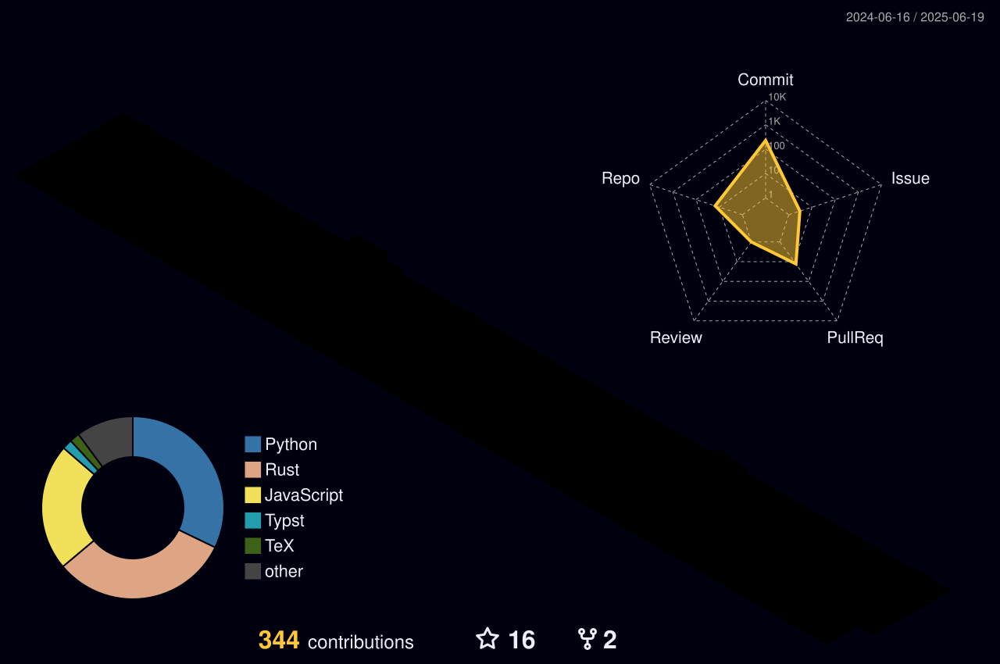
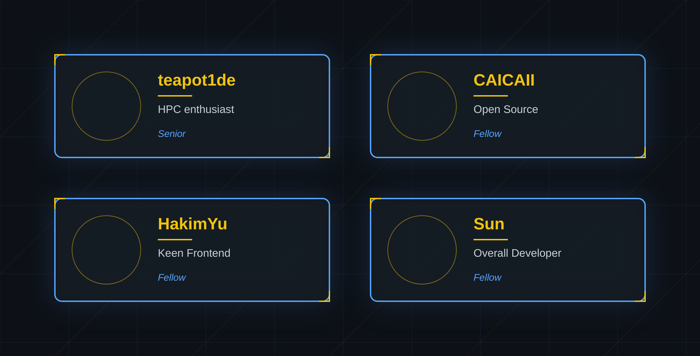

<!--
**SXP-Simon/SXP-Simon** is a ✨ _special_ ✨ repository because its `README.md` (this file) appears on your GitHub profile.
-->

<!-- thanks for:https://github.com/NolanHo/NolanHo -->
> 
<em>
>     何か成す者とは歩み続ける愚者である、成せぬ者とは歩めを止めた賢者である
>      
>     成一事者，矢志不渝之愚者；毁一事者，停滞不前之贤者
>      
>     Feats would await those who daftly enough never cease to forward,
>      
>     folds always come around when you are wise enough to never attempt.
> </em>

> 

>     &mdash;&mdash;&mdash;《ロクでなし魔術講師と禁忌教典》
> 

<!-- https://github.com/DenverCoder1/readme-typing-svg -->

 

 

<!-- https://github.com/anuraghazra/github-readme-stats -->

<!-- https://github.com/DenverCoder1/github-readme-streak-stats -->

<!-- https://github.com/Ashutosh00710/github-readme-activity-graph -->
<!-- 
  -->

<!-- New 3D Contribution Graph -->

<!-- https://github.com/anuraghazra/github-readme-stats -->

<!-- https://github.com/anuraghazra/github-readme-stats -->
<!--  -->

<!--  -->

<!-- https://github.com/LelouchFR/skill-icons -->
<!--  -->

## My Friends 

  <!-- Card Style PNG Version -->
  
  <em>Card-style visualization of my GitHub friends~</em>

 

## About Me
<!-- https://github.com/badges/shields -->

<!-- https://github.com/antonkomarev/github-profile-views-counter -->
<!--  -->

<!-- https://github.com/kyechan99/capsule-render -->

 

 